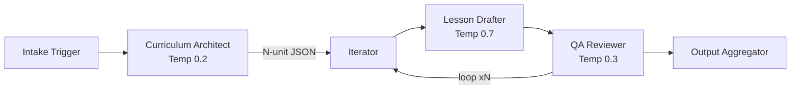

# AI Lesson Plan Automation Pipeline

A **multi-agent AI workflow** that automatically generates complete course lesson plans (up to 20 units) using three chained LLM agents with a Gemini-primary / Groq-fallback architecture.

Built as a portfolio project demonstrating production-grade AI orchestration, prompt engineering, and resilient API design.

---

## Architecture



| Stage | Agent | Temperature | Purpose |
|-------|-------|-------------|---------|
| 1 | Intake Trigger | — | Accepts topic, audience; reads language from `.env` |
| 2 | Curriculum Architect | 0.2 | Generates syllabus as structured JSON |
| 3 | Iterator | — | Loops through each unit sequentially |
| 4 | Lesson Drafter | 0.7 | Writes a full Markdown lesson plan per unit |
| 5 | QA Reviewer | 0.3 | Validates Bloom's Taxonomy, formatting, completeness |
| 6 | Output Aggregator | — | Consolidates all lessons into one Markdown file |

---

## Quick Start

### 1. Clone & Install

```bash
git clone https://github.com/amrendra7777/ai-lesson-plan-automation.git
cd ai-lesson-plan-automation
python -m venv venv && source venv/bin/activate
pip install -r requirements.txt
```

### 2. Configure Environment

```bash
cp .env.example .env
# Edit .env with your API keys
```

```env
GEMINI_API_KEY=your-gemini-key-here
GROQ_API_KEY=your-groq-key-here    # Free at console.groq.com
LANGUAGE=Português Brasileiro
TEST_MODE=false
```

### 3. Run the Pipeline

```bash
python main.py --topic "Machine Learning Fundamentals" --audience "CS undergraduates"
```

The generated lesson plan is saved to the `output/` directory.

---

## API Fallback System

The pipeline uses a **two-provider fallback** for resilience against API rate limits and high-demand errors (503/429):

1. **Primary: Google Gemini** (`gemini-2.5-flash`) — called first on every request
2. **Fallback: Groq** (`llama-3.3-70b-versatile`) — instantly used if Gemini returns 503/429
3. If both fail, the pipeline alternates between them with exponential backoff (1s → 2s → 4s... capped at 30s) for up to 5 total attempts
4. After any successful call, the next call always starts with Gemini again

Console output shows which provider is active in real time:
```
[API] Using Gemini (attempt 1/5)...
[API] Gemini failed (503/429). Switching to Groq...
[API] Using Groq (attempt 1/5)...
```

---

## Test Mode

Set `TEST_MODE=true` in `.env` to generate only **4 units** instead of 20. All pipeline stages, formatting, and output behave identically — useful for fast iteration and testing your API keys.

A visible warning is shown at startup:
```
WARNING: TEST MODE ENABLED -- generating 4 units only
```

---

## Project Structure

```
ai_lesson_plan_automation/
├── main.py           # CLI entry point (--topic, --audience)
├── pipeline.py       # 6-stage orchestrator with progress UI
├── api_caller.py     # Gemini/Groq fallback logic
├── agents.py         # LLM agent functions
├── prompts.py        # System prompt templates
├── config.py         # Centralized configuration (.env loader)
├── requirements.txt  # Python dependencies
├── .env.example      # Environment variable template
└── output/           # Generated lesson plans (gitignored)
```

---

## Configuration

All configuration is via the `.env` file:

| Variable | Default | Description |
|----------|---------|-------------|
| `GEMINI_API_KEY` | *(required)* | Google Gemini API key |
| `GEMINI_MODEL` | `gemini-2.5-flash` | Gemini model to use |
| `GROQ_API_KEY` | *(required)* | Groq API key — free at [console.groq.com](https://console.groq.com/keys) |
| `GROQ_MODEL` | `llama-3.3-70b-versatile` | Groq fallback model |
| `LANGUAGE` | `Português Brasileiro` | Output language for lesson plans |
| `TEST_MODE` | `false` | Set `true` to generate 4 units instead of 20 |

---

## Output Format

Each run produces a consolidated Markdown file containing:

- Course header with metadata
- N complete lesson plans, each with:
  - **Learning Objectives** (Bloom's Taxonomy verbs)
  - **Estimated Time**
  - **Step-by-Step Instructional Content**
  - **Practical Exercise**
  - **Knowledge Check**

---

## Tech Stack

- **Python 3.10+**
- **Google Gemini API** (`google-genai`) — primary LLM provider
- **Groq API** (`openai` SDK) — fallback LLM provider
- **Rich** — polished terminal progress UI
- **python-dotenv** — environment configuration

---

## License

MIT
