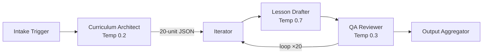

# AI Lesson Plan Automation Pipeline

A **multi-agent AI workflow** that automatically generates complete **20-unit course lesson plans** using three chained LLM agents powered by Google Gemini.

Built as a portfolio project demonstrating production-grade AI orchestration, prompt engineering, and modular Python architecture.

---

## Architecture



| Stage | Agent | Temperature | Purpose |
|-------|-------|-------------|---------|
| 1 | Intake Trigger | — | Accepts topic, audience; reads language from `.env` |
| 2 | Curriculum Architect | 0.2 | Generates a 20-unit syllabus as structured JSON |
| 3 | Iterator | — | Loops through each unit sequentially |
| 4 | Lesson Drafter | 0.7 | Writes a full Markdown lesson plan per unit |
| 5 | QA Reviewer | 0.3 | Validates Bloom's Taxonomy, formatting, completeness |
| 6 | Output Aggregator | — | Consolidates all 20 lessons into one Markdown file |

---

## Quick Start

### 1. Clone & Install

```bash
git clone <your-repo-url>
cd ai_lesson_plan_automation
pip install -r requirements.txt
```

### 2. Configure Environment

```bash
cp .env.example .env
# Edit .env and add your Gemini API key
```

```env
GEMINI_API_KEY=your-key-here
GEMINI_MODEL=gemini-2.5-flash
LANGUAGE=Português Brasileiro
```

### 3. Run the Pipeline

```bash
python main.py --topic "Machine Learning Fundamentals" --audience "CS undergraduates"
```

The generated lesson plan will be saved to the `output/` directory.

---

## Project Structure

```
ai_lesson_plan_automation/
├── main.py           # CLI entry point (--topic, --audience)
├── pipeline.py       # 6-stage orchestrator with progress UI
├── agents.py         # Gemini API agent wrappers
├── prompts.py        # System prompt templates
├── config.py         # Centralized configuration (.env loader)
├── requirements.txt  # Python dependencies
├── .env.example      # Environment variable template
└── output/           # Generated lesson plans (gitignored)
```

---

## Configuration

All configuration is via the `.env` file:

| Variable | Default | Description |
|----------|---------|-------------|
| `GEMINI_API_KEY` | *(required)* | Your Google Gemini API key |
| `GEMINI_MODEL` | `gemini-2.5-flash` | Gemini model to use |
| `LANGUAGE` | `Português Brasileiro` | Output language for lesson plans |

---

## Output Format

Each run produces a consolidated Markdown file containing:

- Course header with metadata
- 20 complete lesson plans, each with:
  - **Learning Objectives** (Bloom's Taxonomy verbs)
  - **Estimated Time**
  - **Step-by-Step Instructional Content**
  - **Practical Exercise**
  - **Knowledge Check**

---

## Tech Stack

- **Python 3.10+**
- **Google Gemini API** (`google-genai`)
- **Rich** — polished terminal progress UI
- **python-dotenv** — environment configuration

---

## License

MIT
